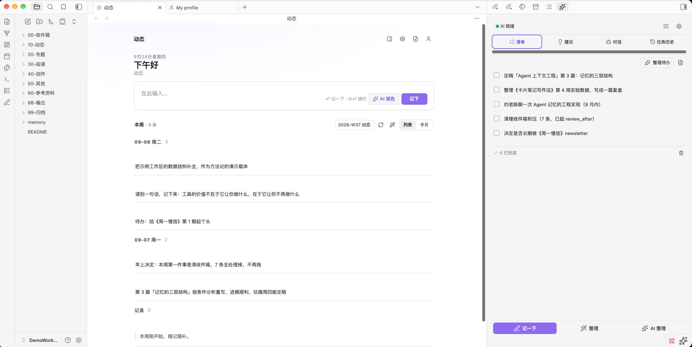
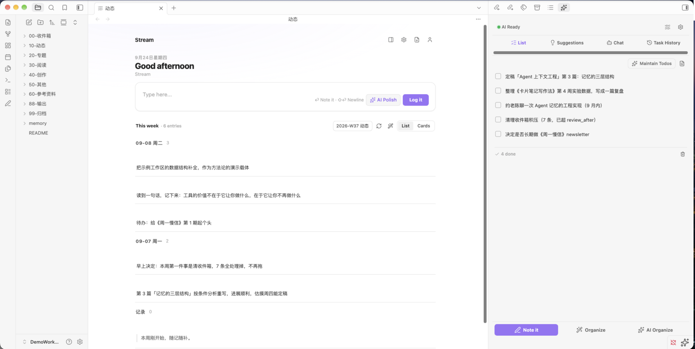
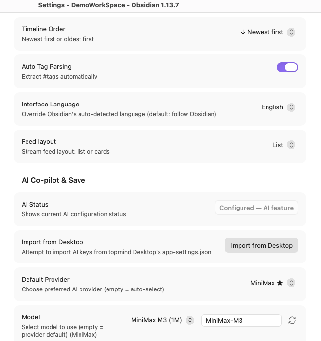
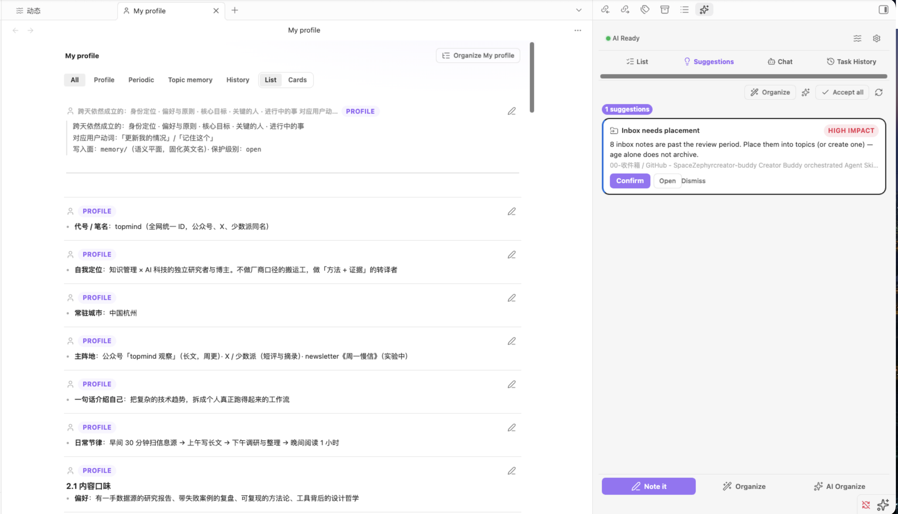

# topmind Stream for Obsidian

[English](README.md) | [简体中文](README.zh-CN.md)

[](https://obsidian.md)
[](LICENSE)
[](https://obsidian.md)
[](manifest.json)

> **Obsidian 的「主区域动态流 + 静默 AI 沉淀副驾」**  
> 随手记下、AI 默认建议、用户确认后再沉淀、文件永远属于本地。

---

## 界面预览

| 动态时间轴 | 我的情况 |
|---|---|
|  |  |

| AI 副驾设置 | English UI |
|---|---|
|  |  |

更多：[My Profile (English)](docs/images/profile-memory-en.png)。

---

## 这是什么？

**topmind Stream** 将 topmind 引擎的核心**低摩擦个人动态流体验**带入 Obsidian。

传统笔记往往要求在记录前先想好分类、标签与文件夹层级。topmind Stream 将其转变为顺畅的即时流式体验：

```text
收进来 -> 继续做 -> 交付/沉淀 -> 找回/调整
随手记下  ->  AI 后台默认建议  ->  用户确认后再沉淀  ->  文件永远属于本地
```

- **零负担记录**：突发的随笔想法、网页剪藏、代码片段随意记下，不再为「放在哪里」而犹豫。
- **本地优先与纯标准 Markdown**：无专有数据库锁定，无私有格式。所有数据均存储在 Vault 中（`topmind.yaml` + 编号分类目录）。
- **主动而不打扰的 AI 辅助**：后台自动提取待办事项、建议专题涌现、整理我的情况，但**未经用户确认，绝对不会擅自修改本地文件**。

---

## 核心能力

- **记一下**：打开完整捕捉弹窗（快捷键在 Obsidian 设置 → 快捷键 自行绑定）。落点：本周动态或 Inbox。
- **动态页签**：Obsidian 主区域时间轴；输入栏 **记下** 写入周期本；卡片流 + AI 建议。
- **AI 副驾面板**（侧边栏）：标签式右侧面板统一汇聚全部 AI 能力 — **清单**、**建议**、**对话**、**任务历史** — 一站式管理。头部为 AI 状态点 + 任务徽章 + 快捷入口；模型切换在「对话」与设置。
- **AI 对话**：与 AI 对话你的笔记、清单和动态。上下文感知 — 自动注入近期动态条目、当前清单和个人画像，让 AI 回答更有针对性。
- **整理本周**：一键 reconcile 周期本、AI 提取待办事项并刷新涌现建议。
- **后台 AI 副驾**：自动提炼待办（`memory/todo.md`）、建议专题涌现、整理个人画像记忆（`memory/profile.md`）。
- **快速设置入口**：侧边栏头部与动态工具栏为 icon+文本（默认宽度显示全称；窄栏才藏字）。刷新与整理用不同图标。模型徽章显示当前 AI 服务商 + 模型。
- **安全写回与备份**：所有写入经由 Kernel `writeback-engine` 闸口（`open`/`locked`）；**仅高影响**（locked 覆盖、锁定/核心删除）写备份/回执。归档是迁入 `99-归档` 的新家，不是备份。

---

## 用户核心概念（≤ 5）

topmind Stream 通过 5 个通俗直观的概念降低认知负担：

| 概念 | 含义 | Vault 落点 |
|------|------|------------|
| **记一下** | 随手存一条想法/片段 | 本周动态周期本 / `00-Inbox/` |
| **动态** | 日常流水与时间轴 | `10-动态/`（每周一本） |
| **专题** | 长期主题归档 | `{大类}/{YYYY-主题}/` |
| **我的情况** | 记忆平面浏览（画像 / 周期反思 / 专题记忆） | `memory/` 下的文件（默认画像 `memory/profile.md`） |
| **交付** | 最终成品与文章 | `88-交付/` |

---

## 快速开始

### 1. 安装

#### 方式 A：Obsidian 官方社区插件市场（发布审核中）
1. 打开 **Obsidian 设置** → **社区插件**。
2. 关闭安全模式，点击 **浏览**。
3. 搜索 **Topmind Stream**。
4. 点击 **安装**，然后 **启用**。

#### 方式 B：使用 BRAT 插件一键安装
1. 在 Obsidian 社区插件中安装并启用 **BRAT** (TfTHacker / obsidian-42-brat)。
2. 打开 BRAT 设置，点击 **Add Beta plugin**。
3. 输入仓库地址：`topmindspace/topmind-obsidian`
4. 点击 Add Plugin，启用 **Topmind Stream**。

#### 方式 C：手动解压安装
1. 从 [GitHub Releases](https://github.com/topmindspace/topmind-obsidian/releases) 下载最新版的 `topmind-obsidian-<ver>.zip`。
2. 解压并将 `topmind-stream` 文件夹放入你的 Obsidian Vault 目录：`<Vault>/.obsidian/plugins/`。
3. 重新打开 Obsidian，在 **设置 → 社区插件** 中开启 **Topmind Stream**。

#### 升级
| 方式 | 操作 |
|------|------|
| 社区市场 / BRAT | 从插件列表更新 / BRAT「检查更新」 |
| 手动 zip | 下载新版 `topmind-obsidian-<ver>.zip`，替换 `plugins/topmind-stream/` 下的文件，重新加载 Obsidian |
| 从源码构建 | `npm run obsidian:pack` → 按上述方式安装 |

你的 Vault 文件（`topmind.yaml`、`10-动态/`、`memory/`）**不会**被插件升级替换。版本真源：[`manifest.json`](./manifest.json)（`npm run versions`）。

---

### 2. 初始化工作区

首次启用时，Topmind Stream 会检查你的 Vault 是否已包含 topmind 工作区结构（`topmind.yaml` 和编号分类目录）。

- **已有工作区**：自动检测，无需设置。
- **全新 Vault**：进入 **设置 → Topmind Stream**，选择模板（`stream`、`balanced`、`research` 或 `periodic`），点击 **初始化工作区**。

---

### 3. 配置 AI 副驾（可选）

进入 **设置 → Topmind Stream → AI 副驾与写回策略**：

- **服务商看板（全部可见）**：国际 / 国内 / 本地三组同时展示 — OpenAI、Anthropic、Google Gemini、DeepSeek、Moonshot、Zhipu、MiniMax、xAI、Groq、Mistral、OpenRouter、Qwen、Doubao、SiliconFlow、Baidu、Hunyuan、Ollama、Custom。每行可填 Base URL + API Key，已配置显示 ✓，可设默认 ★。
- **模型**：下拉 + 自定义模型 ID + 刷新。已配置密钥/端点时走官方 list-models，否则用 [models.dev](https://models.dev) 社区目录，再回退精选默认。
- **从 Desktop 导入**：一键导入 topmind Desktop 的 `app-settings.json` 中已配置的 AI 密钥。
- 选择**写回模式**：
  - `confirm`（*删除/归档前问我* — 推荐）：分级——内容新建/更新/编辑直接落盘；仅删除/归档需你确认。
  - `auto`（*自动保存*）：自动应用 AI 建议，同时自动创建后台备份。

*注：AI 完全是可选的！极速捕捉、时间轴浏览和手动周整理无需 API 密钥即可流畅使用。*

---

### 4. 日常使用

- 命令面板 → **Topmind: 记一下**（在 Obsidian 设置 → 快捷键 中绑定快捷键）。
- `Cmd/Ctrl + P` → **Topmind: 打开动态** 打开时间轴页签。
- 点击左侧 Ribbon 栏的 **铅笔图标** 即可打开**记一下**。

产品词汇（与 Desktop 对齐）：**记一下** / Note it · **记下** / Log it · 动态 · 专题 · 我的情况 · 交付。

---

## 命令面板参考

| 命令 | 说明 |
|------|------|
| `Topmind: 记一下` | 捕捉笔记或片段（默认：本周动态） |
| `Topmind: 打开动态` | 打开动态时间轴页签 |
| `Topmind: 打开侧边栏` | 打开侧边栏面板 |
| `Topmind: 整理本周` | 整理周期本并刷新建议 |
| `Topmind: 刷新 AI 建议` | 重新生成 AI 建议卡片 |
| `Topmind: AI 整理待办` | 对近期活动运行 AI 待办提取 |
| `Topmind: 主题分类` | 运行 AI 主题分类 |
| `Topmind: 整理我的情况` | 运行 AI 整理我的情况（画像 + 周期） |
| `Topmind: 打开我的情况` | 打开记忆平面浏览（点开条目仍落到 vault 文件） |
| `Topmind: 打开 Inbox` | 打开 Inbox 分类目录 |

---

## 架构与生态

Topmind Stream 是 **Topmind Monorepo 生态**的一个可选表面。它与 Topmind Desktop、UTR CLI 和便携 AI Skills 共享同一套核心 Kernel 引擎和目录契约。

```text
Obsidian 表面 (TypeScript + esbuild)
  ├── ItemView 与侧边栏面板
  ├── 设置页签 (PluginSettingTab)
  └── Vault 桥接与 AI Provider 层
        │
        ▼
Kernel 八引擎 (打包 lib/*.mjs)
  contract · workspace-model · stream · memory
  writeback · lifecycle · derived · ingest
  + todo / ai-operation / suggest / activity-window
        │
        ▼
Obsidian Vault (纯文件系统 = 唯一内容真源)
  topmind.yaml + {NN-分类}/ + memory/ + .topmind/
```

### 对比：Desktop 应用 vs. Obsidian 插件

| 特性 / 维度 | Topmind Desktop | Topmind Obsidian 插件 |
|-------------|-----------------|----------------------|
| **主要定位** | 独立富桌面应用 | Obsidian 内嵌原生视图 |
| **编辑器类型** | Tiptap 富文本 & 所见即所得 | Obsidian 原生 Markdown 编辑器 |
| **AI 运行时** | Vercel AI SDK v7 | Obsidian `requestUrl`（OpenAI / Anthropic / Gemini 兼容） |
| **共享引擎** | Kernel `lib/` 八引擎 | Kernel `lib/` 八引擎（打包内联） |
| **数据格式** | 标准 Markdown | 标准 Markdown（同一 Vault） |

*你可以在 Topmind Desktop 和 Obsidian 中同时打开同一个 Vault，互不冲突。*

---

## 安全、隐私与数据保护

- **本地优先存储**：所有笔记和元数据均以标准 Markdown 文件存储在你的磁盘上。
- **零遥测**：topmind 不追踪、不收集、不向外部服务器发送你的使用数据。
- **API Key 安全**：API 密钥存储在 Vault 的 `.obsidian` 目录下插件的 `data.json`，并备份到 `.topmind/ai-keys-backup.json`（均为明文，请勿用于共享 Vault）。
- **写回保护**：所有 AI 驱动的文件变更通过 `writeback-engine`（`open`/`locked`）。备份/回执仅高影响（锁定覆盖、锁定/核心笔记删除归档），普通开放更新不造归档副本。

---

## 开发与构建

```bash
# 安装依赖
npm install

# 启动 esbuild watch 模式
npm run dev

# 生产构建
npm run build

# TypeScript 类型检查
npm run typecheck

# 运行单元测试
npm test

# 验证打包完整性
npm run pack:verify

# 创建 release ZIP 包
npm run pack
```

---

## 环境要求

- **Obsidian 版本**：桌面端 ≥ `v1.13.0`（暂不支持移动端；桌面优先设计）。
- **Node.js**：≥ `v20.11`（从源码构建需要）。

---

## 协议

[MIT License](LICENSE) © [TopMindSpace](https://github.com/topmindspace)
